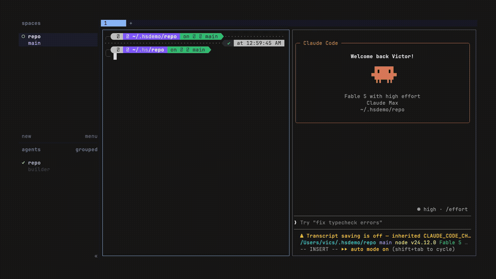

# herdr-conductor

> Orchestrate a feature-delivery team as **visible Herdr agent panes**. An
> orchestrating agent dispatches worker agents (builder, validator, reviewer…),
> watches them on a live board, and stands the team down cleanly.

The fourth StructuPath Herdr plugin, and the operational surface for the
**Conductor** pattern. Where [herdr-swarm](https://github.com/StructuPath/herdr-swarm)
fans out N *identical* agents into worktrees, Conductor runs a *role-differentiated
team* — each worker is a real, attachable Herdr pane, mixed-vendor
(claude/codex/pi), and **survives the orchestrator** (a crashed driver doesn't kill
the team).

Verified on **herdr 0.7.5**.



**Docs:** the [StructuPath Herdr Plugins wiki](https://github.com/StructuPath/herdr-browser/wiki)
is the practical guide to this plugin and its three siblings (Browser, Guard,
Swarm).

## The two halves

| | Where it lives | What it does |
|---|---|---|
| **Transport** (the loop) | `scripts/conductor-lib.sh` | Sourced by an orchestrating agent to drive workers: `conductor_start_worker` → `conductor_dispatch` → `conductor_await` → `conductor_collect` → `conductor_teardown`. |
| **Team** (declare it once) | `.herdr-conductor.json` + `roles/` | One declaration of who is on the team; `conductor_assemble` stands all of them up — worktrees, guard drops, panes. |
| **Operational surface** (this plugin) | `assemble` / `board` / `status` / `harvest` / `stand-down` | Make a run visible and manageable as a first-class Herdr citizen. |

Dispatch is agent-driven, not an action, because Herdr plugin actions get no argv
and no TTY — the intelligence that decomposes a feature and assigns roles is the
orchestrating agent's, not a shell script's.

## Why an agent, not an action

The orchestrating agent (any coding agent in a Herdr pane) sources the transport
and runs the loop. Completion is gated on a **report sentinel written to a file**,
never on agent state — a worker reaches `idle` after *any* turn, including a
clarifying question, so "settled" is not "done". Workers exchange work through
`.conductor/task.md` (in) and `.conductor/report.md` (out); panes are for humans to
watch and attach to.

```bash
# inside the orchestrating agent's pane
. scripts/conductor-lib.sh
conductor_assemble                                    # the whole team, from the config
conductor_dispatch builder-engine "$(CONDUCTOR_MISSION='Add the widget engine.' \
                                     conductor_render_role builder-engine contract.md)"
conductor_await    builder-engine && conductor_collect builder-engine
conductor_reconcile                                   # merge the writer branches
```

Workers warm on start by default (a cold interactive agent opens on a welcome
screen and drops its first prompt); pass `--no-warm` if you own a ≥180s first turn.
Every worker cwd gets a `.conductor/.gitignore` so transport state is never
committed.

## Declaring a team

Put `.herdr-conductor.json` in the repo the team will work on:

```json
{
  "version": 1,
  "base_branch": "main",
  "roles": [
    { "name": "builder-engine", "kind": "claude", "mode": "write",
      "owns": "engine, catalog, domain logic", "must_not_own": "UI layout, routes" },
    { "name": "builder-ui", "kind": "claude", "mode": "write",
      "owns": "components, routes, UI states", "must_not_own": "engine internals" },
    { "name": "validator", "kind": "codex", "mode": "gated",
      "launch_args": ["--sandbox", "workspace-write"] },
    { "name": "reviewer", "kind": "codex", "mode": "read-only",
      "launch_args": ["--sandbox", "read-only"] }
  ]
}
```

`mode` is the one knob that drives isolation and enforcement:

| mode | worktree + branch | guard drop | for |
|---|---|---|---|
| `write` | yes | no | builders and test-author — own a slice, commit to a role branch |
| `gated` | yes | no source edits, but writes allowed | validator — running gates *needs* writes (`.pytest_cache`, `node_modules`, coverage), so it is scoped to a disposable worktree rather than locked |
| `read-only` | no (base tree) | yes | reviewer — pure diff review, locked by launch flags |

`template` defaults to the role name and selects a prompt from `roles/`
(`builder-engine`, `builder-ui`, `test-author`, `validator`, `reviewer` — the
five feature-delivery-team roles, verbatim). `conductor_render_role` fills the
`{{MISSION}}` / `{{CONTEXT}}` / `{{OWNS}}` / `{{MUST_NOT_OWN}}` slots and appends
the report-sentinel contract, so no template can forget the thing completion
gates on.

The guard drop is a `.herdr-guard.json` audit policy — substring rules at
severity `alert`, which is all a repo-supplied override is permitted. It is a
trail, not a sandbox: Guard sees rendered pane text and cannot block a write.
The launch flags are the actual enforcement.

## Actions

```bash
herdr plugin action invoke assemble   --plugin structupath.conductor   # stand the team up
herdr plugin action invoke board      --plugin structupath.conductor   # open the live board
herdr plugin action invoke status     --plugin structupath.conductor   # one-shot table
herdr plugin action invoke harvest    --plugin structupath.conductor   # merge writer branches
herdr plugin action invoke stand-down --plugin structupath.conductor   # close worker panes
```

- **Assemble** — reads the workspace's `.herdr-conductor.json` and stands up every
  role: a git worktree per writing role, a guard audit drop per review role, one
  live agent pane each. Then opens the board. Re-running reuses workers and
  worktrees that already exist, so a crash mid-assemble is recoverable.
- **Board** — one row per worker: role, kind, pane, live status (from
  `herdr agent list`, not terminal scraping), and cwd. Refreshes every 2s; `q` quits.
- **Status** — the same answer as one printed table, for a log or a plain shell.
- **Harvest** — merges every writing role's branch into one integration worktree.
  Nothing is forced and no branch is deleted: a `CONFLICT` row means that branch
  was left alone for a human. Exits non-zero if any branch conflicted or is missing.
- **Stand down** — closes only conductor-owned panes for the active run (ownership
  verified); git branches and worktrees are left intact.

The target repo is resolved from herdr's `HERDR_PLUGIN_CONTEXT_JSON.workspace_cwd`,
never from ambient cwd — an action inherits whatever cwd the herdr server had, and
trusting it silently targets the wrong repository.

## Install

```bash
herdr plugin install StructuPath/herdr-conductor    # from the marketplace
# or, for local dev:
herdr plugin link /path/to/herdr-conductor
```

Health check:

```bash
herdr plugin list           # enabled?
herdr plugin action list    # actions registered?
```

## The composition

Conductor is one of three plugins that compose into a full orchestration substrate,
each doing the one job it does well:

```
CONDUCTOR decides   →   SWARM isolates        →   GUARD enforces
(this plugin)           (worktree per writer)     (read-only audit for review roles)
```

## Requirements

- herdr ≥ 0.7.5, Node ≥ 20, Python 3, Bash (3.2+).
- macOS / Linux. (Herdr has documented Windows plugin defects; not supported.)

## Layout

```
herdr-plugin.toml         manifest (five actions + the board pane)
scripts/conductor-lib.sh  the transport (agent sources this) — proven on 0.7.5
scripts/lib.sh            plugin glue: run resolution, board JSON over the run registry
scripts/assemble.sh       action: stand up the declared team, then open the board
scripts/board.sh          action: open the board pane (singleton)
scripts/status.sh         action: one-shot status table
scripts/harvest.sh        action: merge writer branches (KTD-7 reconcile)
scripts/stand-down.sh     action: teardown via the transport
scripts/board-pane.sh     pane entrypoint → exec bin/renderer.mjs
roles/                    the five feature-delivery role prompts, with {{slots}}
bin/renderer.mjs          zero-dep live board renderer
tests/                    node --test
docs/plans/               the Conductor plan (Tier 1 + Tier 2 lineage)
```

`scripts/conductor-lib.sh` is canonical here; pi-library's `feature-delivery-team`
skill vendors a byte-identical copy of it plus `roles/`. Edit here, then re-vendor.
